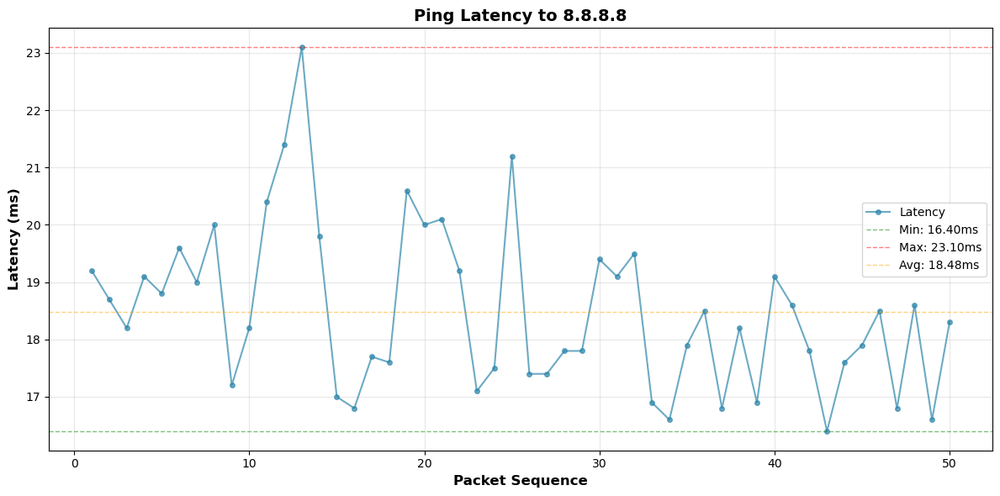

# PingPlot

Visualize ping latency as a graph with CLI-compatible output.

## Features

- **ASCII Graph**: Display latency over time in the terminal with extended ASCII line drawing
- **Image Output**: Generate professional PNG graphs with matplotlib
- **Multiple Output Formats**: ASCII, JSON, CSV, and PNG image
- **Statistics**: Min, max, average latency, and packet loss
- **Customizable**: Control ping parameters, graph dimensions, and figure size

## Installation

### Basic Installation (ASCII and data formats only)

```bash
chmod +x pingplot.py
```

### With Image Support

For image output, install matplotlib:

```bash
pip install matplotlib
chmod +x pingplot.py
```

## Usage

### Basic Usage (ASCII Graph)

```bash
./pingplot.py 192.168.88.101
```

### With Custom Ping Parameters

```bash
./pingplot.py 192.168.88.101 -c 100 -i 0.1 -s 1400
```

### Output Formats

**ASCII Graph (default):**
```bash
./pingplot.py 192.168.88.101 --format ascii --height 20 --width 80
```

**Image Output (PNG):**
```bash
./pingplot.py 192.168.88.101 --format image
./pingplot.py 192.168.88.101 --format image -o my_ping_graph.png
./pingplot.py 192.168.88.101 --format image --figsize 14,8
```

**JSON Output:**
```bash
./pingplot.py 192.168.88.101 --format json
```

**CSV Output:**
```bash
./pingplot.py 192.168.88.101 --format csv
```

## Options

- `host`: Target host to ping
- `-c, --count`: Number of ping packets (default: 100)
- `-i, --interval`: Interval between packets in seconds (default: 0.1)
- `-s, --size`: Packet size in bytes (default: 1400)
- `--format`: Output format: ascii, json, csv, or image (default: ascii)
- `--height`: Graph height for ASCII output (default: 20)
- `--width`: Graph width for ASCII output (default: 80)
- `-o, --output`: Output file path for image format (default: pingplot_HOST.png)
- `--figsize`: Figure size for image output as 'width,height' (default: 12,6)

## Example Output

### ASCII Graph Output

```
Latency Graph (min: 16.80ms, max: 25.50ms, avg: 19.69ms, lost: 0)
       ┌────────────────────────────────────────────────────────────────────────────────┐
25.50ms│             █                                                                  │
       │             █▇                                                                 │
       │      ▃      ██                                                                 │
       │      █      ██                                                                 │
       │      █      ██     ▇                                                           │
       │      █      ██     █         ▅ ▆            ▁                                  │
       │▄     ██     ██     █         █ █       ▆    █                                  │
       │█▅    ██     ██     █        ▄█ █       █    █                                  │
       │██    ██     ██ ▃   █        ██▂█  ▆  ▇ █    █                                  │
       │██▇   ██  ▁  ██ █   █   ▅  █ ████▇ █▁▃█ █▅   █                                  │
       │███▁  ██▄ █  ██ █  ▄█ ▄▄█ ▅█ █████ ████▄██  ▅█▆▄                                │
       │████▅▅███ █▆▃██▅█▁ ██ ███ ██▄█████▄███████  █████                               │
       │█████████▄████████ ██▅███ █████████████████▃██████                              │
       │██████████████████ ██████▇████████████████████████                              │
16.80ms│██████████████████████████████████████████████████                              │
       └────────────────────────────────────────────────────────────────────────────────┘
                                             Time →
```

### Image Output (PNG)

```bash
./pingplot.py 192.168.88.101 --format image
```



## Requirements

- Python 3.6+
- `ping` command available on system
- Appropriate permissions to run ping (may require sudo on some systems)
- `matplotlib` (optional, required for image output)

